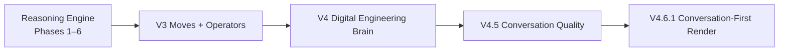

# SRIIVERSEAI

**The digital headquarters of Sudhanshu Sinha** — Python backend engineer, AI developer, and full-stack engineer.

> *Building Intelligent Software That Solves Real Problems.*

A handcrafted, **build-free** single-page portfolio with an embedded reasoning assistant (**SRIIVERSE AI**). No npm install, no bundler — serve the folder and open it.

[Live demo](https://github.com/sriiverse/Portfolio) · [Upgrade history](docs/UPGRADE_HISTORY.md) · [Changelog](docs/CHANGELOG.md) · [Evaluation suite](docs/AI_EVALUATION_SUITE.md)

---

## Quick start

ES modules require HTTP (browsers block `file://` imports).

```bash
# Python
python -m http.server 5500
# → http://localhost:5500

# Node
npx serve .
```

Or use VS Code **Live Server**, or deploy the folder to Netlify / Vercel / GitHub Pages (zero build step).

Windows helper: `.\serve.ps1`

---

## What you get

| Surface | What it does |
|---|---|
| **Portfolio** | Hero (Three.js), projects, stack, five-layer architecture, journey, contact |
| **SRIIVERSE AI** | Offline portfolio assistant — conversation-first engineering dialogue |
| **Recruiter mode** | Hiring-fit answers grounded in shipped work |
| **Resume intelligence** | Conversational background summary (no PDF required) |
| **JD matching** | Paste a job description → match score, gaps, talking points |
| **Interview practice** | Topic-scoped mock interview (Python, SQL, React, Backend, AI/ML) |

---

## Assistant evolution (at a glance)



| Release | Focus |
|---|---|
| **Reasoning Engine** | Question → entities → evidence → confidence → plan → compose |
| **V3** | Conversational moves; decision-first recommend / evaluate / rank |
| **V4** | Knowledge graph, decision records, identity, operators, reflection, adaptive audiences |
| **V4.5** | Intent gate, bound follow-ups, gap/presentation/shape quality |
| **V4.6.1** | Answer first; brochure only when the visitor asks for a walkthrough |

Full narrative with diagrams: **[`docs/UPGRADE_HISTORY.md`](docs/UPGRADE_HISTORY.md)**.  
Latest rendering contract: **[`docs/V4_6_CONVERSATION_FIRST_RENDERING.md`](docs/V4_6_CONVERSATION_FIRST_RENDERING.md)**.

---

## Reasoning pipeline

SRIIVERSE AI runs a staged pipeline, then adaptive flow and reflection:

```
Mode / Command Gate
  → Question Understanding (+ conversation mode)
  → Entity Resolution
  → Evidence Selection
  → Confidence
  → Response Planning
  → Response Composition (± operator synthesis)
  → Adaptive flow (audience, continuity, length)
  → Reflection finalize
```

**Conversation vs documentation**

| Ask | Behavior |
|---|---|
| “Which project first?” / “Why Flask?” / “Criticize X” | Spoken answer (project supports) |
| “Walk me through X” / architecture deep dive | Project documentation card |

**Design rules:** knowledge first, never fabricate, honest decline when data is missing, expand only when asked.

| Doc | Purpose |
|---|---|
| [`docs/UPGRADE_HISTORY.md`](docs/UPGRADE_HISTORY.md) | Professional upgrade record + diagrams |
| [`docs/CHANGELOG.md`](docs/CHANGELOG.md) | Versioned release notes |
| [`docs/REASONING_ENGINE_SPEC.md`](docs/REASONING_ENGINE_SPEC.md) | Pipeline contract |
| [`docs/AI_EVALUATION_SUITE.md`](docs/AI_EVALUATION_SUITE.md) | Evaluation ground truth |
| [`docs/FINAL_BENCHMARK.md`](docs/FINAL_BENCHMARK.md) | Suite results |

---

## Repository layout

```
index.html                 Entry + import map (Three.js) + CDN libs
src/
  main.js                  Boot sequence
  content.js               Source of truth — profile, projects, stack, KB
  scene.js / core.js       3D hero + scroll / UI chrome
  sections.js              Projects, orbs, architecture, timeline
  assistant.js             Orchestrator (pipeline + mode gates)
  assistant/
    conversation.js        Question Understanding + conversationMode
    entities.js            Entity Resolution + Confidence
    knowledge.js           Evidence Selection (scoped retrieval)
    planning.js            Response Planning (ResponsePlan / blocks)
    providers.js           Composition + brochure gate
    reasoning.js           Strategy classify + V4 operators
    graph.js / decisions.js / identity.js
    reflection.js / adaptive.js / persona.js / memory.js
    jdmatch.js / interview.js / tools.js / renderer.js
  styles.css               Design system
docs/                      Specs, upgrade history, validations, changelog
assets/                    Static assets (e.g. resume.pdf)
tests/                     Sprint 2 + V4 regression suites
```

---

## Customise

Almost everything lives in **`src/content.js`**:

- `PROFILE`, `PROJECTS`, `STACK`, `ARCHITECTURE`, `JOURNEY`, `STATS`
- `ASSISTANT_KB`, `SKILLS_TAXONOMY`, `INTERVIEW_QUESTIONS`

Assistant voice and tech opinions live in **`src/assistant/persona.js`** (`ASSISTANT_CAPABILITIES`, `TECH_TAKES`, `SELF_MODEL`).

| Placeholder | Where |
|---|---|
| `resume.pdf` | `assets/` + `PROFILE.resume` |
| Email / socials | `PROFILE` |
| Stats marked `placeholder: true` | `STATS` |

---

## Stack

**Three.js · GSAP · Lenis · WebGL** — vanilla ES modules, no framework, no build step.

- Dark, space-inspired UI; `prefers-reduced-motion` respected  
- Cursor / 3D / assistant degrade gracefully if a CDN lib fails  
- Content grounded in live demos + public profile — nothing invented

---

## Docs index

| Document | Topic |
|---|---|
| [UPGRADE_HISTORY.md](docs/UPGRADE_HISTORY.md) | Full upgrade narrative + diagrams (V3→V4.6.1) |
| [V4_6_CONVERSATION_FIRST_RENDERING.md](docs/V4_6_CONVERSATION_FIRST_RENDERING.md) | Latest rendering contract |
| [CHANGELOG.md](docs/CHANGELOG.md) | Versioned release notes |
| [PROJECT_ARCHITECTURE.md](docs/PROJECT_ARCHITECTURE.md) | System overview |
| [AI_ASSISTANT_SPEC.md](docs/AI_ASSISTANT_SPEC.md) | Assistant product spec |
| [REASONING_ENGINE_SPEC.md](docs/REASONING_ENGINE_SPEC.md) | Pipeline contract |
| [CURSOR_RULES.md](docs/CURSOR_RULES.md) | Engineering constraints |
| [CONTRIBUTING.md](docs/CONTRIBUTING.md) | How to contribute |
| [PHASE_1…6_VALIDATION.md](docs/) | Per-phase validation reports |
| [RENDERING_POLISH_VALIDATION.md](docs/RENDERING_POLISH_VALIDATION.md) | Composition polish |

---

## License

Personal portfolio project. © Sudhanshu Sinha / SRIIVERSEAI.

---

Built to demonstrate **architecture, backend judgment, applied AI, and product honesty** — not just a pretty landing page.
