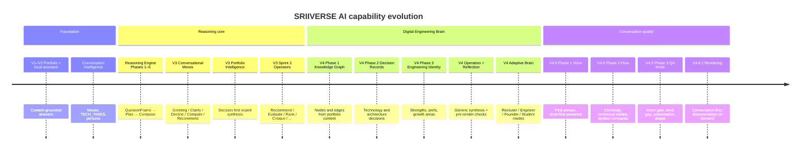
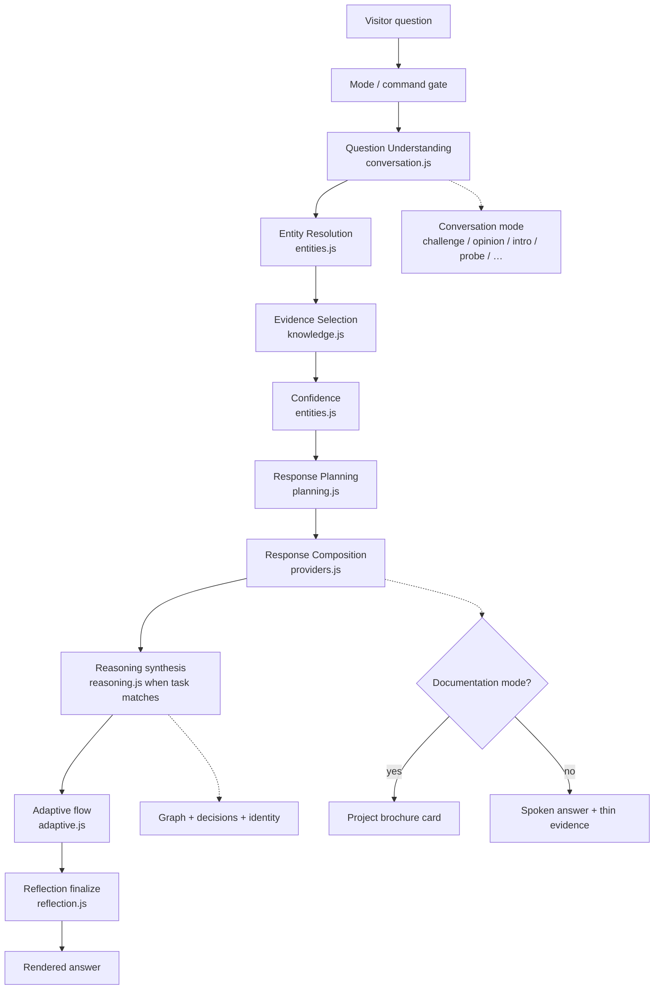
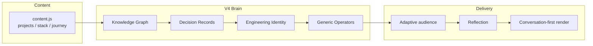
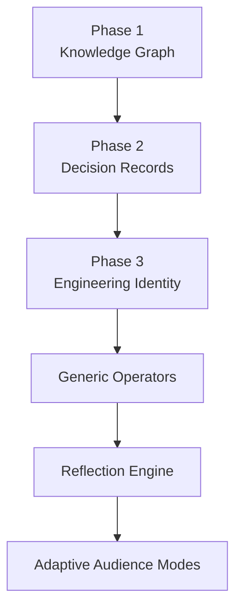
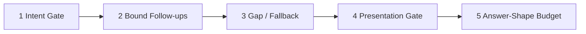
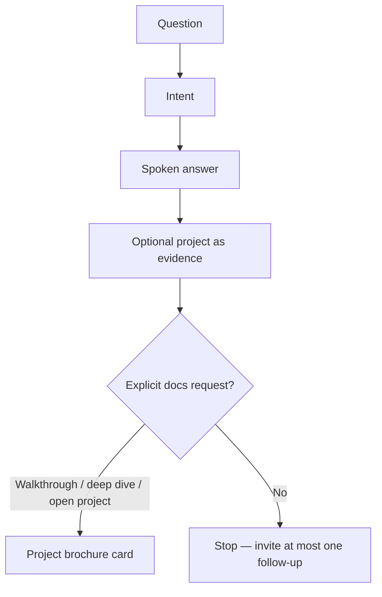

# SRIIVERSE AI — Upgrade History

**Product:** SRIIVERSE AI (portfolio engineering assistant)  
**Current surface:** V4.6.1 — Conversation-First Rendering  
**Repository:** [sriiverse/Portfolio](https://github.com/sriiverse/Portfolio)  
**Last updated:** 2026-07-29

This document is the professional record of how the assistant evolved from a grounded local Q&A surface into a conversation-first digital engineering brain. It summarizes architecture, delivery phases, and behavioral contracts without replacing the detailed phase specs under `docs/`.

---

## 1. Executive summary

SRIIVERSE AI answers questions about Sudhanshu Sinha’s shipped work **only from portfolio evidence**. Over successive upgrades it gained:

1. A frozen **reasoning pipeline** (understand → entities → evidence → confidence → plan → compose)
2. A **V4 intelligence layer** (knowledge graph, decision records, engineering identity, generic operators, reflection)
3. **Adaptive audience modes** and **conversation quality** controls (intent gate, bound follow-ups, gap/fallback, presentation, answer shape)
4. A **conversation-first rendering contract** (answer the question; use projects as evidence; brochure only when explicitly requested)

**Non-goals that remain true:** no required LLM backend for core behavior, no fabricated employers/metrics, no redesign of the knowledge graph for each polish pass.

---

## 2. Evolution timeline



---

## 3. Current system architecture

### 3.1 End-to-end request path



### 3.2 Intelligence layers (V4)



| Layer | Module | Role |
|---|---|---|
| Knowledge graph | `src/assistant/graph.js` | Portfolio entities and relations |
| Decision records | `src/assistant/decisions.js` | Why Flask / FastAPI / five-layer calls, etc. |
| Engineering identity | `src/assistant/identity.js` | Strengths, prefs, growth areas (documented vs inferred) |
| Operators | `src/assistant/reasoning.js` | Recommend, Rank, Evaluate, Critique, Explain, … |
| Reflection | `src/assistant/reflection.js` | Pre-render honesty / voice checks |
| Adaptive | `src/assistant/adaptive.js` | Audience mode, continuity, invites, length budget |
| Composition | `src/assistant/providers.js` | Plan → markdown; brochure gate |

---

## 4. Upgrade catalog

### 4.1 Reasoning Engine (Phases 1–6)

**Intent:** Replace ad-hoc retrieval answers with a staged, testable pipeline.

**Delivered:**

- QuestionFrame + subject resolution (2nd/3rd person parity)
- Entity ownership (`owned` / `gap` / `unknown`)
- Scoped evidence and confidence tiers
- ResponsePlan / ResponseBlocks
- LocalProvider Stage-8 composition

**Contract:** Knowledge first; honest decline when evidence is missing; greetings bypass evidence gates.

**Validation:** `docs/REASONING_ENGINE_SPEC.md`, phase reports `PHASE_1`…`PHASE_6`, `FINAL_BENCHMARK.md`.

---

### 4.2 V3 — Conversational moves & portfolio intelligence

**Intent:** Speak like an engineer in dialogue, not a FAQ.

**Delivered:**

- Conversational moves: Greeting, Clarify, Decline+pivot, Compare, Recommend, Answer
- Portfolio Intelligence / Sprint 2 strategy classification
- Decision-first evaluative answers (Recommend / Evaluate / Rank / …)

**Validation:** `docs/V3_CONVERSATIONAL_ARCHITECTURE.md`, `V3_SPRINT1_VALIDATION.md`, `V3_SPRINT2_VALIDATION.md` (51/51 gate).

---

### 4.3 V4 — Digital Engineering Brain



| Phase | Outcome |
|---|---|
| **1 — Graph** | Engineering graph derived from portfolio content |
| **2 — Decisions** | Structured decision records for tech/architecture choices |
| **3 — Identity** | Faceted identity claims (documented vs inferred) |
| **Operators** | Case-table synthesis replaced by operators over graph/decisions/identity |
| **Reflection** | Answers verified before return (implementation-voice scrub, honesty) |
| **Adaptive** | Recruiter / Engineer / Founder / Student emphasis without inventing facts |

**Docs:** `V4_PHASE1_KNOWLEDGE_GRAPH.md`, `V4_PHASE2_DECISION_RECORDS.md`, `V4_PHASE3_ENGINEERING_IDENTITY.md`.

---

### 4.4 V4.5 — Conversation quality

Driven by a Lead-QA audit: the assistant still sounded templated under adversarial and multi-turn pressure. Fixes were grouped by **root cause**, not by individual finding.



| Modification | Behavioral contract |
|---|---|
| **Conversational Intent Gate** | Challenge / self / opinion / preference_gap / ops_story / probe / brief / intro win over false entity gaps and wrong recommend paths |
| **Bound Follow-up State** | Session `lastCommitment` + `activeMode`; “Why that one?” stays on the recommended project |
| **Gap & Fallback Contract** | Honesty once; no duplicate gap lines; soft topics do not become FAQ declines |
| **Presentation Gate** | Markdown brochure not default for every project mention |
| **Answer-Shape Budget** | Suppress sticker phrases; ownership “Yes —” only for yes/no skill checks |

**Regression gate preserved:** Sprint 2 **51/51**.

---

### 4.5 V4.6.1 — Conversation-first rendering

**Problem:** Many turns still *rendered portfolio sections* instead of *answering the question*.

**Principle:**

> The project supports the answer. The project must never replace the answer.



| Rule | Behavior |
|---|---|
| Default length | ~4–8 sentences |
| Brochure / `##` / Problem–Solution | Only for walkthrough, deep dive, documentation, open project, explicit architecture/stack-of asks |
| Continuity leads | Only on genuine follow-ups |
| Intro | “Tell me about yourself” → first-person intro (never Unknown fallback) |
| Recommend | “Which project should I look at first?” → spoken pick + why |

**Primary modules touched:** `providers.js` (brochure gate, named-project walkthrough), `adaptive.js` (continuity + length), `conversation.js` / `reasoning.js` (intro + recommend/overview routing).

---

## 5. Behavioral contracts (current)

### 5.1 Honesty

- Unknown tech → short negative + optional adjacent stack (once)
- No invented employers, certifications, or QPS numbers
- Soft / opinion questions get scoped takes, not false “no record of …” gaps

### 5.2 Conversation vs documentation

| Visitor ask | Mode |
|---|---|
| Which project first? / Why Flask? / Criticize X | **Conversation** |
| Walk me through X / Architecture of X / Open project | **Documentation** |

### 5.3 Multi-turn

- Commitments (`activeProject`, `activeMode`, `lastCommitment`) bind follow-ups
- False continuity (“Building on…”) is suppressed unless the turn is a real follow-up

---

## 6. Quality gates

| Gate | Purpose | Status |
|---|---|---|
| `tests/v3_sprint2_reasoning.test.mjs` | Operator / recommend / evaluate regression | **51/51** |
| `tests/v4_adaptive_brain.test.mjs` | Audience + flow | Green |
| `tests/v4_reflection.test.mjs` | Reflection contracts | Green |
| `tests/v4_phase1_graph.test.mjs` | Graph integrity | Green |
| `tests/v4_phase2_decisions.test.mjs` | Decision records | Green |
| `tests/v4_phase3_identity.test.mjs` | Identity facets | Green |

Run locally:

```bash
node --test tests/v3_sprint2_reasoning.test.mjs tests/v4_*.test.mjs
```

---

## 7. Module map (assistant)

```
src/assistant.js              Orchestrator
src/assistant/
  conversation.js             QuestionFrame + conversationMode
  entities.js                 Entities + confidence
  knowledge.js                Evidence / retrieval
  planning.js                 ResponsePlan
  providers.js                Composition + brochure gate
  reasoning.js                Strategy classify + operators
  graph.js / decisions.js / identity.js
  reflection.js / adaptive.js / persona.js
  memory.js                   Session bind + visitor profile
  jdmatch.js / interview.js / tools.js / renderer.js
```

---

## 8. Related documents

| Document | Scope |
|---|---|
| [CHANGELOG.md](./CHANGELOG.md) | Versioned release notes |
| [REASONING_ENGINE_SPEC.md](./REASONING_ENGINE_SPEC.md) | Pipeline contract |
| [V3_CONVERSATIONAL_ARCHITECTURE.md](./V3_CONVERSATIONAL_ARCHITECTURE.md) | V3 moves |
| [V4_PHASE1_KNOWLEDGE_GRAPH.md](./V4_PHASE1_KNOWLEDGE_GRAPH.md) | Graph |
| [V4_PHASE2_DECISION_RECORDS.md](./V4_PHASE2_DECISION_RECORDS.md) | Decisions |
| [V4_PHASE3_ENGINEERING_IDENTITY.md](./V4_PHASE3_ENGINEERING_IDENTITY.md) | Identity |
| [V3_SPRINT2_VALIDATION.md](./V3_SPRINT2_VALIDATION.md) | Sprint 2 gate |
| [FINAL_BENCHMARK.md](./FINAL_BENCHMARK.md) | 203-question suite |

---

## 9. Design stance going forward

1. **Prefer rendering and routing fixes** over new architecture when conversation quality regresses.
2. **Preserve Sprint 2** as the hard regression gate for operator behavior.
3. **Keep documentation mode explicit** — never reintroduce automatic Problem/Solution dumps for ordinary questions.
4. **Expand only when asked** — brevity is the default product feel.

---

*Maintained as the living overview of SRIIVERSE AI upgrades. Detailed validation remains in the phase-specific docs above.*
