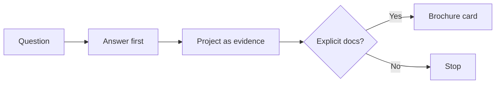

# V4.6.1 — Conversation-First Rendering

**Status:** Shipped  
**Date:** 2026-07-29  
**Scope:** Response rendering layer (composition + adaptive flow)  
**Non-scope:** No new reasoning architecture, graph redesign, or identity rewrite

---

## Problem

The assistant often answered by **rendering portfolio sections** (Problem / Solution / Features / Architecture) instead of answering the visitor’s question in spoken form.

```text
Ask: Which project should I look at first and why?
Bad:  ## QueryForge → Problem → Solution → Features …
Good: I'd start with RepoRadarAI because you can demo the live split…
```

---

## Contract



| Default | Documentation mode (explicit only) |
|---|---|
| 4–8 sentences | Walkthrough / deep dive / open project / architecture of / stack for |
| Thin project mention | Full `##` / 🎯 Problem–Solution card |
| ≤1 follow-up invite | Same |

---

## Implementation notes

| Area | Change |
|---|---|
| `buildSystemPrompt()` | Conversation-first; section templates only for docs mode |
| `_allowsProjectBrochure()` | Strict keyword gate; project retrieval ≠ card |
| `_renderPlan()` | Named-project walkthrough resolves project from query |
| `_spokenProjectSummary()` | One supporting sentence, not a mini-brochure |
| Continuity | Only `isBoundFollowUpQuery` |
| Intro mode | `tell me about yourself` → `self_intro` |
| Length budget | Clamp conversational turns; preserve tables/cards |

---

## Validation samples

| Prompt | Expectation |
|---|---|
| Tell me about yourself | First-person intro |
| Which project first? | Spoken recommend |
| Why that one? | Bound follow-up |
| Criticize QueryForge | Spoken critique |
| Explain QueryForge | Short overview |
| Walk me through QueryForge | Full project card |
| Would you rebuild it differently? | Architecture trade-off answer |

**Regression:** Sprint 2 **51/51** and V4 suites green at ship time.

See also: [UPGRADE_HISTORY.md](./UPGRADE_HISTORY.md).
